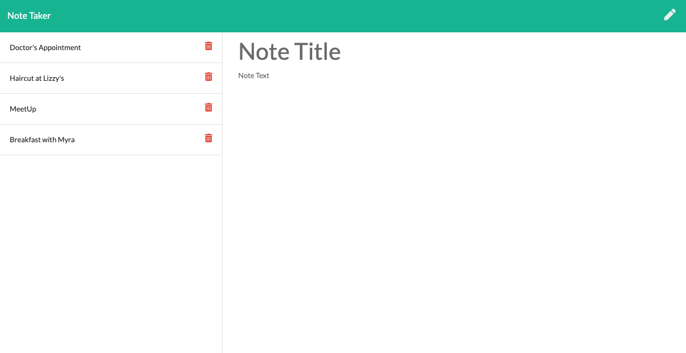

# Title: 
  Take Notes- by Soumya

  # Description of the Project:
  This is a very useful application for anyone who like to make notes of things and wants them to be kept safe with them. They should be able to delete once the task is done and keep adding new notes as and when required.

  # Installation Instructions:
  Use the delpoyed link to use the app

  # Usage Information:
  Helps user to make their own notes.

  # Contribution Guidelines:
  N/A

  # Test Instructions:
  Use the deployed link to start the application, input the title of your new note, add your note in the text section, press save button on the top right corner of the page and view your new note. In case of deletion, simply press trash button to do so.

  # GitHub Link:
  GitHub Link for this App: https://github.com/sosingh1226/takenotes

  # Deployed:
  Deployed Link for this App: 

  # Screeshots:
  
  
  